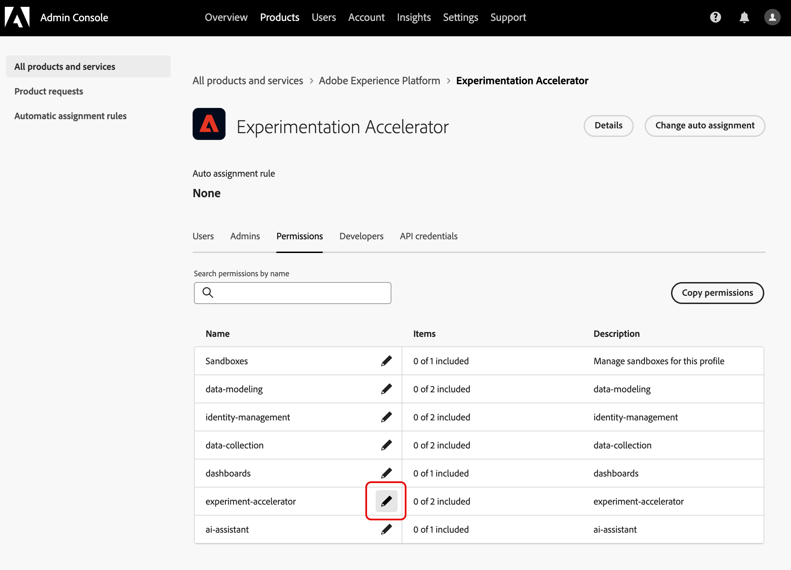
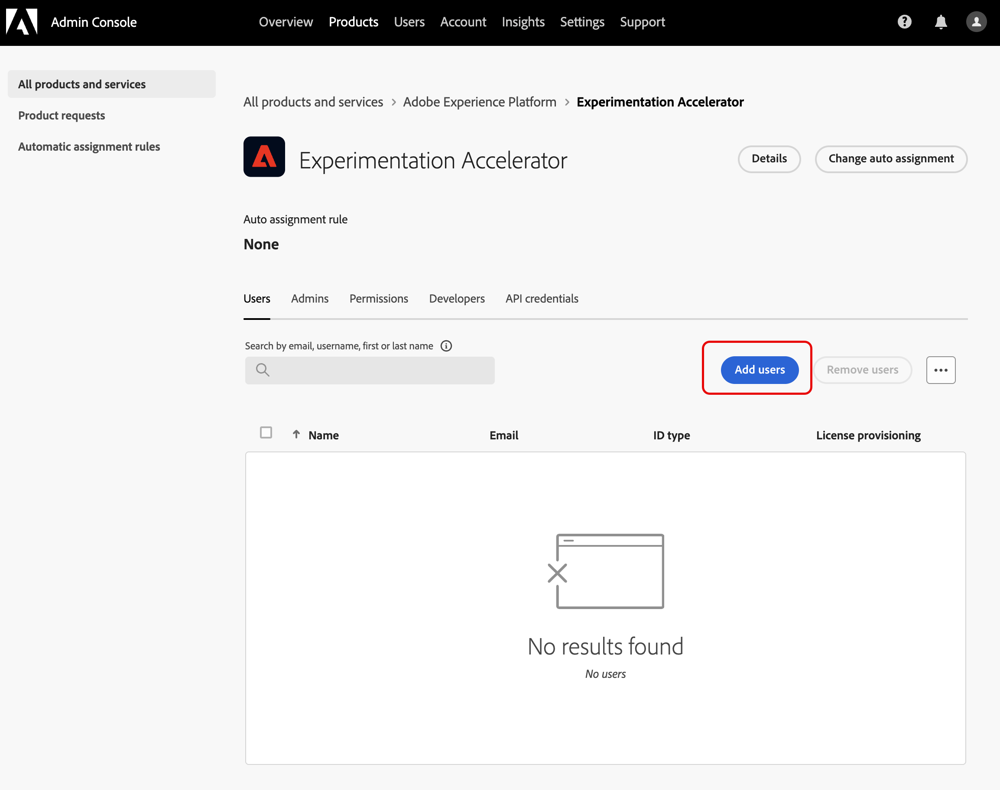

# 存取 Journey Optimizer Experimentation Accelerator

在[建立並設定您的實驗](https://experienceleague.adobe.com/zh-hant/docs/journey-optimizer/using/content-management/content-experiment/content-experiment)並將您的行銷活動或歷程傳送至您的設定檔後，您可以存取&#x200B;**[!UICONTROL Journey Optimizer Experimentation Accelerator]**，以深入瞭解您的實驗如何執行。

您可以從[!UICONTROL Experimentation]下拉式清單的左側功能表，或透過Apps切換器存取&#x200B;**[!UICONTROL Journey Optimizer Experimentation Accelerator]**。 請注意，只有Target授權的使用者只能透過應用程式切換器存取。

可用的實驗取決於您的設定：

* **若為Adobe Journey Optimizer使用者**：在您已啟用組織的沙箱中設定的實驗會自動包含在內。

* **對於具有Journey Optimizer的Adobe Target使用者**： Target中的任何A/B活動都會出現在Journey Optimizer的生產沙箱中的&#x200B;**[!UICONTROL Journey Optimizer Experimentation Accelerator]**。

* **僅適用於Adobe Target使用者**：您Target組織中的所有A/B活動都包含在Journey Optimizer的生產沙箱中。

若要使用&#x200B;**[!UICONTROL Journey Optimizer Experimentation Accelerator]**，您需要存取沙箱以及下列相關許可權：

* **[!UICONTROL 檢視實驗]**
* **[!UICONTROL 管理實驗中繼資料]**

+++ 瞭解如何使用Adobe Experience Platform或Adobe Journey Optimizer授權指派實驗相關許可權

1. 在&#x200B;**[!DNL Permissions]**&#x200B;產品中，移至&#x200B;**[!UICONTROL 角色]**&#x200B;標籤，並選取所需的&#x200B;**[!UICONTROL 角色]**。

1. 按一下&#x200B;**[!UICONTROL 編輯]**&#x200B;以修改權限。

1. 新增&#x200B;**[!UICONTROL 實驗加速器]**&#x200B;資源，然後從下拉式功能表中選取&#x200B;**[!UICONTROL 檢視實驗]**&#x200B;和/或&#x200B;**[!UICONTROL 管理實驗中繼資料]**。

   

1. 按一下&#x200B;**[!UICONTROL 儲存]**，以套用所做的變更。

任何已指派給此角色的使用者都會自動更新其權限。

若要將此角色指派給新使用者：

1. 導覽至[角色]儀表板中的[使用者]索引標籤&#x200B;**&#x200B;**，然後按一下[新增使用者]&#x200B;**&#x200B;**。

1. 輸入使用者的名稱、電子郵件地址，或從清單當中選擇，然後按一下&#x200B;**[!UICONTROL 儲存]**。

   如果使用者先前未建立，請參閱[此檔案](https://experienceleague.adobe.com/zh-hant/docs/experience-platform/access-control/abac/permissions-ui/users)。

使用者將會收到一封電子郵件，提供存取執行個體的指示。

+++

 

+++ 瞭解如何使用Adobe Target授權指派實驗相關許可權

1. 開啟&#x200B;**[Admin Console](http://adminconsole.adobe.com/)**。

1. 在&#x200B;**[!UICONTROL 產品]**&#x200B;中，選擇&#x200B;**[!UICONTROL Adobe Experience Platform]**。

1. 按一下&#x200B;**[!UICONTROL 新設定檔]**。

   

1. 輸入設定檔的&#x200B;**[!UICONTROL 名稱]**&#x200B;和&#x200B;**[!UICONTROL 描述]**，然後按一下&#x200B;**[!UICONTROL 儲存]**。

1. 開啟您新建立的&#x200B;**[!UICONTROL 設定檔]**，並導覽至&#x200B;**[!UICONTROL 許可權]**&#x200B;標籤。

1. 按一下&#x200B;**[!UICONTROL experimentation-accelerator]**&#x200B;許可權旁的。

   

1. 新增此設定檔應具有的許可權，例如&#x200B;**[!UICONTROL 檢視實驗]**&#x200B;和&#x200B;**[!UICONTROL 管理實驗中繼資料]**，然後按一下&#x200B;**[!UICONTROL 儲存]**。

   >[!TIP]
   >
   > 當使用者需要不同的存取層級時，請建立個別的設定檔。 例如，建立僅包含&#x200B;**[!UICONTROL 檢視實驗]**&#x200B;的&#x200B;**[!UICONTROL Experimentation Accelerator Viewer]**&#x200B;設定檔，以及包含&#x200B;**[!UICONTROL 檢視實驗]**&#x200B;和&#x200B;**[!UICONTROL 管理實驗中繼資料]**&#x200B;的&#x200B;**[!UICONTROL Experimentation Accelerator編輯器]**&#x200B;設定檔。

   

1. 從&#x200B;**[!UICONTROL 許可權]**&#x200B;索引標籤中，選取&#x200B;**[!UICONTROL 沙箱]**。

1. 新增使用者應能使用Journey Optimizer Experimentation Accelerator的沙箱，然後按一下「儲存」**&#x200B;**。

1. 開啟&#x200B;**[!UICONTROL 使用者]**&#x200B;索引標籤，然後按一下&#x200B;**[!UICONTROL 新增使用者]**。

   

1. 新增應接收此存取許可權的使用者，然後按一下[儲存]。**&#x200B;**

新增至此設定檔的使用者現在可以從應用程式切換器存取Journey Optimizer Experimentation Accelerator。

+++

<!--
table style="table-layout:fixed"><tr style="border: 0;">
<td>

<strong><a href="experiment-accelerator-overview.md">Overview</a></strong>

</td>
<td>

<strong><a href="experiment-accelerator-monitor.md">Experiments</a></strong>

</td>
<td>

<strong><a href="experiment-accelerator-metrics.md">Metrics</a></strong>

</td>
</tr></table
-->
